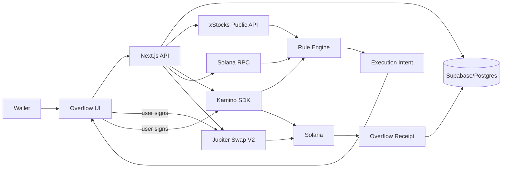

# OVERFLOW — Programmable Earnings

> **Keep the source. Program the earnings.**

Overflow is a Solana application that isolates the economic output generated by an asset and lets the user route **only those earnings** somewhere else while preserving the source position.

This repository is the frozen Stocklana submission build. It implements two adapters:

1. **xStocks cash dividends → programmable destination**
2. **Kamino USDC Earn interest → programmable destination**

Execution is intentionally **non-custodial and user-signed** in V1. A rule can detect that earnings are ready, but Overflow cannot spend on behalf of the user without a wallet signature.

---

## What is actually implemented

### Dividend rule

Example:

```text
WHEN   MRKx receives a cash dividend
KEEP   my pre-dividend MRK equity exposure
SEND   the dividend-created exposure to SPYx
EXEC   after the xStocks safety window and only if ≥ $5
```

Overflow reads the real xStocks public corporate-action API and only processes `CashDividend` events. Splits and reverse splits are not interpreted as earnings.

On Solana, xStocks use Token-2022 Scaled UI Amount. The raw token balance remains unchanged while the multiplier changes. If:

```text
R  = raw xStock balance
m0 = multiplier before dividend
m1 = multiplier after dividend
```

Overflow calculates the raw amount created only by the dividend:

```text
floor(R × (m1 − m0) / m1)
```

The amount is rounded **down** deliberately. After routing that raw quantity away, the remaining position must satisfy the strict preservation invariant: the post-dividend scaled exposure is greater than or equal to the pre-dividend exposure. Overflow rounds the removable raw amount down so it never intentionally shaves the source position.

The app waits until the configured safety window has passed after the corporate action effective time before preparing execution.

### Kamino interest rule

Example:

```text
WHEN   my Kamino USDC position earns interest
KEEP   10,000 USDC principal + 0.50 USDC safety buffer
SEND   only harvestable interest to NVDAx
EXEC   when harvestable interest ≥ $5
```

The principal floor is stored explicitly and is **never inferred from the appreciated position**.

```text
harvestable = max(0, redeemableValue − principalFloor − safetyBuffer)
```

Overflow builds the Kamino withdrawal transaction, the user signs it, the backend confirms it, then Overflow prepares the Jupiter swap for the actual withdrawn USDC.

Dividend rules additionally pin the wallet's raw Token-2022 xStock balance at rule activation. Because xStocks multiplier events do not change the raw Solana balance, any later raw-balance drift is treated as an external buy/sell/transfer and the rule moves to `NEEDS_REVIEW` instead of attributing that drift to a dividend. After a `VERIFIED_ON_CHAIN` Overflow execution, the baseline is refreshed to the observed post-trade raw balance.

---

## Integrations

### xStocks

The code uses current public v2 endpoints:

```text
GET /api/v2/public/assets/{symbol}
GET /api/v2/public/assets/{symbol}/multiplier?network=Solana
GET /api/v2/public/assets/{symbol}/multiplier/history?network=Solana
GET /api/v2/public/assets/{symbol}/price-data
GET /api/v2/public/corporate-actions/history
```

Solana mint addresses are discovered dynamically from the asset `deployments` array instead of being hard-coded.

### Kamino

The build uses `@kamino-finance/klend-sdk` with the current `KaminoVault` flow:

- `getUserShares(user).totalShares` (human share units)
- `getExchangeRate(slot)` (underlying tokens per share)
- `getAPYs(slot)`
- `unstakeFromFarmIfNeededIxs` when required
- `withdrawIxs(..., new Decimal(sharesAmount))`

`.env.example` intentionally leaves the Kamino vault blank. Set the exact USDC Earn vault you intend to demo and verify it against Kamino before any funded withdrawal.

### Jupiter Swap API V2

Overflow uses Jupiter's recommended Meta-Aggregator flow:

The backend persists the returned `requestId` and a SHA-256 hash of the unsigned transaction message. `/execute` accepts only a wallet-signed transaction whose message hash matches that prepared order and always uses the server-stored `requestId`.


```text
GET  https://api.jup.ag/swap/v2/order
wallet signs returned VersionedTransaction
POST https://api.jup.ag/swap/v2/execute
```

The app does not implement a custom swap router.

### Solana

- Real mainnet wallet signatures
- Real SPL/Token-2022 raw balance reads
- Real transaction confirmation
- Solscan receipt links

There is no custom Solana program because the product does not require one for V1; the onchain proof is the real protocol interaction and transaction settlement.

---

## Architecture



### Rule engine boundary

Protocol-specific reads/writes live in adapters under `lib/`. The calculation functions in `lib/math.ts` are deterministic and unit-tested.

---

## Repository layout

```text
app/
  api/
    rules/                 rule CRUD
    engine/evaluate/       explicit rule evaluation
    kamino/                unsigned earnings-withdrawal preparation
    execution/             confirm withdrawal + prepare routed amount
    jupiter/               bound Swap V2 execute endpoint; generic order proxy disabled
    receipts/              execution history
    replay/                historical dividend Replay Mode
    health/                deployment/env health check
components/
  OverflowApp.tsx          complete submission UI
lib/
  engine.ts                normalized rules engine
  math.ts                  preservation + earnings math
  xstocks.ts               xStocks v2 adapter
  kamino.ts                Kamino Earn adapter
  jupiter.ts               Jupiter Swap V2 adapter
  solana.ts                raw balances + transaction bridge
  repository.ts            DB persistence
db/migrations/
  001_init.sql
  002_integrity.sql
  003_final_verification.sql
  004_dividend_attribution_and_order_binding.sql
tests/
  math.test.ts             deterministic accounting invariants
  e2e.test.ts              simulated protocol-boundary execution flows
scripts/
  preflight.ts
```

---

## Setup

### 1. Requirements

- Node 22+
- npm 10+
- Solana mainnet RPC (Helius/QuickNode recommended for the demo)
- free Supabase project
- Phantom or Solflare
- Jupiter Developer Platform API key

### 2. Install

```bash
npm install
cp .env.example .env.local
```

### 3. Database

Create a Supabase project and run these migrations **in order**:

```text
db/migrations/001_init.sql
db/migrations/002_integrity.sql
db/migrations/003_final_verification.sql
db/migrations/004_dividend_attribution_and_order_binding.sql
```

Then set:

```env
SUPABASE_URL=...
SUPABASE_SERVICE_ROLE_KEY=...
```

The service-role key is server-only. Never expose it as `NEXT_PUBLIC_*`.

### 4. Jupiter

For the judged deployment, create a Jupiter Developer Platform key and set:

```env
JUPITER_API_KEY=jup_...
```

### 5. Run preflight

```bash
npm run verify:db
npm run verify:xstocks
npm run preflight:prod
```

Before using a funded Kamino position, also run:

```bash
npm run verify:kamino -- <wallet>
```

Compare `redeemableUsd` against the Kamino UI for the same wallet. Do not sign a funded withdrawal until they agree.

The production preflight verifies:

- Solana RPC
- SPYx Solana deployment from xStocks
- corporate-actions API
- Kamino vault account exists
- Jupiter API gateway

### 6. Tests

```bash
npm run typecheck
npm test
npm run build
```

### 7. Run locally

```bash
npm run dev
```

Open `http://localhost:3000`.

---

## Submission verification status

The code is designed for live verification, but **do not submit it as a mainnet-proven build until the checks in `FINAL_DEPLOY_CHECKLIST.md` are complete**. In particular, record at least one real execution that produces a `VERIFIED_ON_CHAIN` receipt and add its Solana signature below.

```text
Verified demo transaction: PENDING — replace before submission
Production URL: PENDING — replace after deployment
```

## Deploy to Vercel

1. Push this repository to GitHub.
2. Import into Vercel.
3. Add all environment variables from `.env.example`.
4. Deploy.
5. Confirm `GET /api/health` returns `ok: true`.
6. Run the funded verification sequence in `FINAL_DEPLOY_CHECKLIST.md`.

The hackathon build evaluates rules explicitly from the UI. It does **not** claim unattended automation or include a background signer/job runner. This keeps V1 non-custodial and makes every mainnet movement user-signed.

---

## Demo setup

For the strongest submission demo, create these two rules from the UI:

```text
MRKx Dividend → SPYx
minimum $5

Kamino USDC Interest → NVDAx
principal floor 10,000 USDC
safety buffer 0.50 USDC
minimum $5
```

### If a live dividend is available

1. Show xStocks corporate action detected.
2. Show `CashDividend`, `m0 → m1`, and earnings-created raw quantity.
3. Wait until the safety window is clear.
4. Click **Review, sign & execute**.
5. Sign the Jupiter transaction.
6. Show the receipt and Solscan transaction.
7. Highlight `Source preserved ✓`.

### If no live dividend is available

Use **Replay Mode**.

Replay Mode:

- fetches a real historical `CashDividend` from xStocks
- shows the real multiplier transition
- applies the exact dividend-isolation math to a clearly labelled hypothetical balance
- does **not** prepare or execute a transaction

Then use the Kamino rule for the live user-signed onchain transaction.

Never present Replay Mode as a live corporate action.

---

## Submission narrative

### One line

**Overflow is the programmable earnings layer for onchain assets.**

### Problem

Assets generate economic output, but that output is usually hard-coded:

- savings yield stays in the savings position or requires manual harvesting
- xStocks dividends are automatically reinvested into the same stock
- traditional DRIP reinvests into the originating security

### Product

Overflow lets the user keep the source asset and program what its earnings become.

```text
USDC interest → NVDAx
MRKx dividend → SPYx
MRKx dividend → USDC
```

### Technical proof

Overflow can isolate the dividend-created portion of an xStock without selling the pre-dividend equity exposure.

### Why Solana

The product composes three live Solana primitives:

- tokenized equities using Token-2022 Scaled UI multipliers
- Kamino Earn
- Jupiter routing and settlement

The rule engine is useful because these assets and protocols are composable on one chain.

---

## 90-second demo script

**0–10 sec**

> Tokenized stocks already bring equities onchain, but their earnings are still hard-coded. Overflow makes the earnings programmable.

**10–20 sec**

Show:

```text
MRKx — Dividend → SPYx — ACTIVE
USDC Savings — Interest → NVDAx — ACTIVE
```

**20–45 sec**

> xStocks reinvest cash dividends through a Token-2022 multiplier. Overflow detects the real corporate action and mathematically isolates only the new dividend-created raw quantity.

Show:

```text
CashDividend
multiplier m0 → m1
pre-event exposure preserved
```

**45–65 sec**

> The user signs once. Jupiter routes only the earnings.

Execute and show real Solana transaction.

**65–78 sec**

Show receipt:

```text
Original MRK exposure preserved ✓
New SPYx acquired ✓
```

**78–86 sec**

Flash Kamino rule:

```text
10,000 USDC principal
interest only → NVDAx
principal used: $0 ✓
```

**86–90 sec**

> Keep the source. Program the earnings. Overflow.

---

## Security / correctness invariants

1. **Dividend rules only process `CashDividend` corporate actions.**
2. **Splits are never treated as income.**
3. **Raw Solana Token-2022 amounts are used for transactions.**
4. **Dividend extraction is rounded down.**
5. **Execution waits beyond the xStocks corporate-action safety window.**
6. **Each corporate action is idempotent per rule.**
7. **Kamino principal is explicit state, not inferred from the current vault value.**
8. **The browser wallet signs every mainnet transaction.**
9. **Kamino withdrawal signatures are bound to the exact server-prepared transaction message.**
10. **Jupiter request IDs and signed transaction messages are bound to server-side execution intents.**
11. **A `VERIFIED_ON_CHAIN` receipt requires the exact authorized source-token spend and a positive destination-token delta from that same transaction.**
12. **The generic Jupiter order proxy is disabled; swaps can only be prepared from a guarded Overflow intent.**
13. **Overflow stores no private key and has no unilateral spending authority.**
14. **Historical Replay Mode is labelled and cannot execute.**

---

## Known limits before a production launch

This is a hackathon deployment candidate that still requires the funded verification gate above; it is not an audited financial product. Before production:

- independent security review
- full legal/geographic eligibility layer for xStocks jurisdictions
- stronger rate limiting and abuse controls
- typed/generated clients from xStocks/Jupiter OpenAPI
- persistent job queue rather than cron-only polling
- RPC redundancy
- transaction simulation telemetry
- explicit user acknowledgement of estimated price/slippage
- monitoring/alerting
- full integration tests against funded test wallets/mainnet fork

No private keys are required by this application.

### Hackathon access-control note

V1 does not include server-side wallet-signature authentication for rule CRUD. A wallet signature is still required for every money-moving Solana transaction, so the backend has no spending authority, but production should add signed-wallet sessions before exposing rule mutation APIs broadly.

---

## License

Hackathon submission code. Add the team's preferred license before public release.
